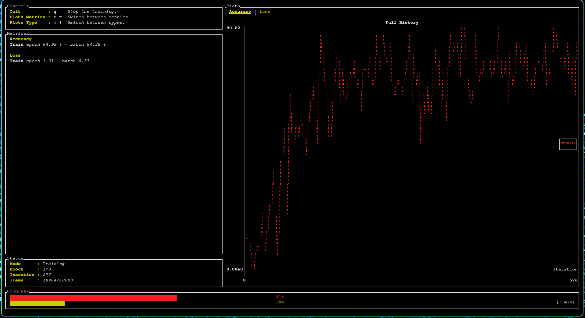

# FashionMNIST CNN in Rust

A Rust port of the PyTorch CNN from [this Colab notebook](https://colab.research.google.com/drive/1RbgsunRZhY__onzDIwo8MyQOy3DNcxoS?usp=sharing),
built with the [burn](https://burn.dev) deep learning framework (pure Rust, no libtorch).

It replicates `FashionMNISTModelV2` from the notebook: a TinyVGG-style
convolutional network trained on FashionMNIST.

## Architecture

Two convolutional blocks followed by a linear classifier:

```
conv_block_1: Conv(1→10, 3x3, pad 1) → ReLU → Conv(10→10, 3x3, pad 1) → ReLU → MaxPool(2)
conv_block_2: Conv(10→10, 3x3, pad 1) → ReLU → Conv(10→10, 3x3, pad 1) → ReLU → MaxPool(2)
classifier:   Flatten → Linear(10*7*7 → 10)
```

With 28x28 input, each block halves the spatial size (28 → 14 → 7), so the
classifier sees 10 channels of 7x7 feature maps.

## Running

```bash
cargo run --release
```

This shows an interactive menu:

```
FashionMNIST CNN
  1. Train a new model
  2. Predict on a test image
Choose an option [1/2]:
```

**1. Train** — On first run it downloads the FashionMNIST IDX files from
Zalando's mirror into `data/` (cached for later runs), then trains for 3 epochs
with SGD (lr=0.1) and a batch size of 32 — matching the notebook's
hyperparameters. Training and validation accuracy/loss are shown live via burn's
dashboard, and a few sample predictions are printed at the end. The trained
model is saved to `artifacts/`.



**2. Predict** — Loads the already-trained model from `artifacts/` (no
retraining) and asks for a test image index (0–9999). It draws that image as
ASCII art in the terminal and prints the predicted class alongside the true one:

```
Test image index (0-9999): 0
        ... (ASCII drawing of an ankle boot) ...
Prediction: Ankle boot
Truth:      Ankle boot
Result:     correct
```

You must train at least once before predicting, since prediction reads the saved
`artifacts/model.mpk` and `artifacts/config.json`.

## Layout

- `src/data.rs` — FashionMNIST download/parse + the batcher (`ToTensor`-style
  pixel scaling to `[0, 1]`).
- `src/model.rs` — the CNN and its `TrainStep` / `InferenceStep` impls.
- `src/training.rs` — training config and the `Learner` loop.
- `src/predict.rs` — loads a saved model and classifies a single image, with
  ASCII-art rendering.
- `src/main.rs` — entry point; interactive menu, selects the CPU (`NdArray`)
  backend.

## Backend

Defaults to the CPU `NdArray` backend wrapped in `Autodiff`. To use a GPU,
swap the backend in `src/main.rs` for `burn::backend::Wgpu` (and add the
`wgpu` feature to burn in `Cargo.toml`).
